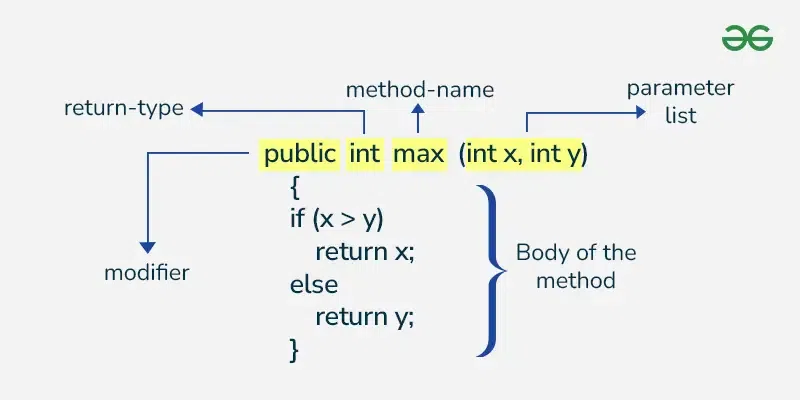

# Giới thiệu về Phương thức (Methods) trong Java

Phương thức trong Java là tập hợp các câu lệnh thực hiện một nhiệm vụ cụ thể và trả kết quả về cho nơi gọi phương thức. Một phương thức cũng có thể thực hiện nhiệm vụ mà không cần trả về kết quả nào. Phương thức giúp chúng ta tái sử dụng mã nguồn mà không cần phải viết lại. Trong Java, mọi phương thức phải thuộc về một lớp (class), khác với các ngôn ngữ như C, C++ hoặc Python.

---

# 1. Định nghĩa và Cú pháp

Phương thức trong Java:

- Là một tập hợp mã thực hiện một nhiệm vụ cụ thể.

- Giúp thể hiện hành vi của một đối tượng.

Lợi ích:

- Tái sử dụng mã nguồn: Giảm việc lặp lại mã.
- Tối ưu hoá mã nguồn: Giúp dễ quản lý và bảo trì.

Cú pháp:

```java
<access_modifier> <return_type> <method_name>(list_of_parameters) {
    // body
}
```

---

# 2. Cấu trúc khai báo phương thức

Khai báo phương thức trong Java gồm 6 thành phần:

1. Modifier (Bộ điều chỉnh): Xác định phạm vi truy cập của phương thức.

- `public`: Truy cập được ở mọi nơi.

- `protected`: Truy cập được trong cùng lớp và các lớp con.

- `private`: Chỉ truy cập được trong lớp khai báo.

- `default`: Truy cập được trong cùng gói (package).

2. Return Type (Kiểu trả về): Định nghĩa kiểu dữ liệu giá trị trả về hoặc void nếu không trả về giá trị. (Bắt buộc)

3. Method Name (Tên phương thức): Phải là động từ viết thường và tuân thủ quy tắc đặt tên của Java. (Bắt buộc)

4. Parameter List (Danh sách tham số): Danh sách các tham số đầu vào, phân cách bởi dấu phẩy và kèm kiểu dữ liệu. (Tùy chọn)

5. Exception List: Liệt kê các ngoại lệ mà phương thức có thể ném ra. (Tùy chọn)

6. Method Body (Thân phương thức): Bao gồm mã nguồn thực thi nhiệm vụ. (Bắt buộc)

<div style="text-align: center;">
  
</div>

---

# 4. Các loại Phương thức

1. Phương thức định nghĩa sẵn (Predefined Method)

- Là các phương thức được định nghĩa sẵn trong thư viện Java.

- Có thể sử dụng trực tiếp trong chương trình mà không cần định nghĩa lại.

2. Phương thức tự định nghĩa (User-defined Method)

- Do lập trình viên viết và tuỳ chỉnh theo yêu cầu.

---

# 5. Các cách tạo Phương thức

1. Phương thức thể hiện (Instance Method)

- Truy cập dữ liệu thể hiện thông qua đối tượng.
- Được khai báo bên trong lớp.

Cú pháp:

```java
void method_name {
    // body
}
```

2. Phương thức tĩnh (Static Method)

- Truy cập dữ liệu thông qua tên lớp.
- Được khai báo với từ khoá `static`

Cú pháp:

```java
static void method_name() {
    // body
}
```

---

# 6. Gọi Phương thức

Phương thức cần được gọi để thực thi. Có thể gọi phương thức trong ba tình huống:

1. Khi hoàn thành tất cả các câu lệnh trong phương thức.

2. Khi gặp lệnh return.

3. Khi ném ra một ngoại lệ.

Ví dụ:

```java
class Addition {
    public int addTwoInt(int a, int b) {
        return a + b;
    }
}

public class Main {
    public static void main(String[] args) {
        Addition add = new Addition();
        int result = add.addTwoInt(5, 3);
        System.out.println("Sum: " + result);
    }
}
```

Output:

```
Sum: 8
```

---

# 7. Đặt tên Phương thức

- Tên phương thức thường là động từ.

- Nếu tên có nhiều từ, các từ sau viết hoa chữ cái đầu.

Quy tắc:

1. Tên phải là động từ viết thường.

2. Với tên có nhiều từ, từ đầu là động từ, các từ sau là danh từ hoặc tính từ.

3. Không trùng tên nếu không sử dụng nạp chồng phương thức (method overloading).

Ví dụ:

- `findSum`

- `computeMax`

- `setX, getX`

---

# 8. Ưu điểm của Phương thức trong Java

1. Tái sử dụng mã: Viết một lần, sử dụng nhiều lần.

2. Trừu tượng hóa: Ẩn đi chi tiết thực thi phức tạp.

3. Đọc dễ dàng: Tách mã thành các khối nhỏ, có tên rõ ràng.

4. Đóng gói: Đảm bảo tính toàn vẹn dữ liệu.

5. Phân tách trách nhiệm: Mỗi phương thức đảm nhận một nhiệm vụ cụ thể.

6. Kiểm tra và gỡ lỗi dễ dàng: Mã dễ kiểm tra hơn.

7. Hiệu suất cao: Tối ưu hóa mã nguồn dễ dàng hơn.

---
